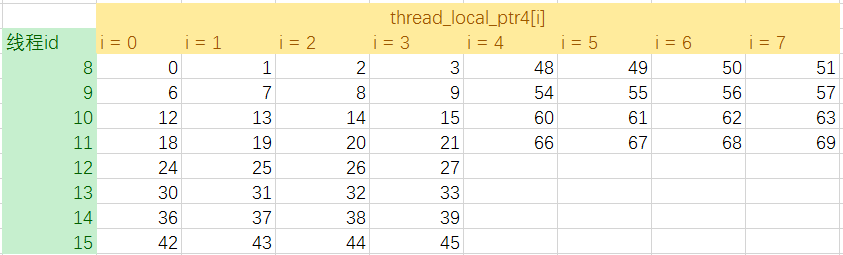

# 神威太湖之光编程入门 
作者：黄承欢 

文档整理：黄华

**使用前请注意：** 

* **本文件不能替代官方资料，请务必以官方资料作为编程指导标准。** 
* **本文件中部分信息是基于实验得出的总结，未必完全准确，也未必在官方资料中出现。**
* **本文件仅供内部参考，请注意保管。**


## 系统基本信息

### 系统架构

SW26010 每一个计算节点有四个核组（CG, Core Group），每个核组有 64 个 SW3 架构的 CPE (Computing Processing Element) 和 1 个 SW5 架构的 MPE(Management Processing Element)。下面是一个计算节点的结构简图：


每一个 CPE （俗称『从核』）有 16KB 指令 L1 和 64KB LDM (Local Data Memory, a.k.a SPM, Scratch Pad Memory) ，无数据 L1，cache line 大小 32 Bytes，运行在 1.45 GHz 的固定频率。

每一个 MPE （俗称『主核』）有 32KB 数据 + 32KB 指令 L1，256KB 数据 L2，cache line 大小 128 Bytes，运行在 1.45 GHz 的固定频率。

每一个 CG 有 64 个 CPE 和一个 MPE，以及 8GB DDR3 内存。四个 CG 通过片上网络（NoC, Network on Chip）进行互联。

神威太湖之光每块电路板（Card）上有 2 个节点。每个支撑板（Board）上有 4 块电路板。每个超节点（Super Node）有 32 个支撑板，32 个支撑板里的 256 个计算节点是全连接的。每个机舱（Cabinet）有4个超节点。

### 系统时延

经查资料和测试，已知以下操作的时延：

| 项目                                       | 所需 cycle 数 |
| ---------------------------------------- | ---------- |
| 整数位运算                                    | 1          |
| MPE <--> MPE L1 Data Cache               | 4          |
| CPE <--> SPM                             | 4          |
| 普通浮点运算                                   | 7          |
| MPE L1 Data Cache <--> MPE L2 Data Cache | 13         |
| SPM <--(DMA)--> DDR3 Memory              | ~25        |
| 浮点开平方                                    | 29         |
| 浮点除法                                     | 31         |
| SPM <--(gld/gst)--> DDR3 Memory          | 278        |
| 主核从核实时交互                                 | ~750       |
| MPI_Sendrecv ping-pong                   | ~7000      |
| athread_spawn / athread_join             | ~22730     |

测试 FMA 时延的代码请参见 `./test_fma_cycle` 文件夹。有一些函数的时延不是很好测试，比如位操作和选择操作的时延，主要是由于编译器优化。

## 使用从核加速

SW26010 的主要计算力量来自从核。要使用从核，必须使用 athread 库（Accelerating THREAD），并且分别为主核和从核编写不同的代码，使用不同的参数和编译器来编译。

### 基本框架

一个主核代码文件一般会包含以下几条语句：

```c
#include <athread.h>         // 使用 athread
// other codes
athread_init();              // 初始化核组
// other codes
athread_spawn(func, param);  // 启动从核核组，一般是 64 条线程，目标函数是 slave_func
// other codes
athread_join();              // 等待从核核组全部执行完毕
// other codes
```

一个从核代码文件一般会包含以下几条语句：

```c
#include <slave.h>
// other codes
void slave_func(void *param)  // 从核计算函数，将会被主核调用
{ /* other codes */ }
// other functions and codes
```

一个简单的 Makefile 文件如下：

```shell
EXE	= test
CC	= mpicc
SCC	= sw5cc
# -msimd 允许程序使用 SIMD 向量化， -std=gnu99 允许程序使用 for (int i = ...) 这样的语法糖
HFLAGS	= -host  -std=gnu99 -O2 -msimd # 主核文件编译可以不加 -host
SFLAGS	= -slave -std=gnu99 -O2 -msimd # 从核文件编译必须加上 -slave
LDFLAGS	=

$(EXE):host.o slave.o
	$(CC) $(LDFLAGS) *.o -o $@

host.o: host.c
	$(CC) -c $(HFLAGS) host.c

slave.o: slave.c
	$(SCC) -c $(SFLAGS) slave.c

clean:
	rm *.o
```

在官方的《基础语言编译手册》（2016年8月1日版，下同）中，有这么一句话：

> 主核代码以 text 为段名，从核代码以 text1 为段名。对位于从核 text1 段中的从核程序，编译器和底层工具链会自动对函数增加”slave_”前缀，如函数 func()会自动换名为 slave_func()。用户已经手工添加 slave_前缀的则不再重复添加。

也就是说，从核代码文件里的函数要被主核调用，有以下两种方式：

第一种：
```c
/* slave.c */
#include <slave.h>
#include "my_slave.h"
// other codes
void slave_func(coid *param)
// other codes

/* my_slave.h */
#ifndef MY_SLAVE_H
#define MY_SLAVE_H
void slave_func(void *param);
// other interfaces
#endif

/* host.c */
#include 
#include "my_slave.h"
// other codes
athread_spawn(func, param);
athread_join();
// other codes
```

注意，编译器里已经有一个 `slave.h`，从核程序需要 `#include <slave.h>`。因此，我们自己写头文件不能和这个重名。

第二种方式，使用 `SLAVE_FUN(<SLAVE_FUNC_NAME>)();` 来告诉编译器：
```c
/* slave.c */
#include <slave.h>
// other codes
void func(coid *param)
// other codes
  
/* my_slave.h */
#ifndef MY_SLAVE_H
#define MY_SLAVE_H
void func(void *param);
// other interfaces
#endif

/* host.c */
#include "my_slave.h"
SLAVE_FUN(func)();
// other codes
athread_spawn(func, param);
athread_join();
// other codes
```
一个简单的 Hello World Demo 在`./hello_world_demo` 文件夹中。其中，`host.c` 定义的 `rpcc()` 用于取得当前 CPU 的 cycle 计数，两次 `rpcc()`  结果之差即为它们中间的代码运行所消耗的墙钟 cycle 数，此值除以 1450000000 即可得到秒数。

如果从核函数有多个参数需要输入，则需要先定义一个 struct 来保存所有的输入参数，再将此 struct 的指针作为参数传给从核函数，和 pthread 的做法一样。一个 daxpy demo 在 `./demo_daxpy` 文件夹中，包含了此操作。也有一种比较偷懒的做法，即在从核代码文件中使用 `extern` 关键字，在主核代码文件中使用全局变量。这样的坏处是不利于组织大型的代码工程。

### 从核间同步

从核之间的同步需要通过 `athread_sync()` 函数来进行，支持行同步、列同步和核组同步：

```c
int total_mask = 0x0000FFFF;   // 低 16 位有效
int row_mask   = 0x000000FF;   // 低 8 位有效
int col_mask   = 0x000000FF;   // 低 8 位有效
athread_syn(ARRAY_SCOPE, total_mask);  // 全核组同步
athread_syn(ROW_SCOPE, row_mask);      // 所有 8 行进行行同步
athread_syn(COL_SCOPE, col_mask);      // 所有 8 列进行列同步
```

### 从核间通信

每一个核组的 64 个从核排列成 8 * 8 的二维 mesh，每一行和每一列的从核都有共享的寄存器，可以使用这些寄存器来进行通信。SWCC 提供四个宏来进行操作，如果将其视为函数，那么这四个函数的接口如下：

```c
simd_type simd_getc(simd_type val);          // 从核接收所在列的通信信息
simd_type simd_getr(simd_type val);          // 从核接收所在行的通信信息
void simd_putc(simd_type val, int dst_row);  // 从核将信息 val 发送到同一列中第 dst_row 行
void simd_putr(simd_type val, int dst_col);  // 从核将信息 val 发送到同一行中第 dst_col 列
```

其中，`simd_type`  为 SWCC 支持的 SIMD 扩展数据类型；`dst_col`  和 `dst_row`  设为 8 的时候即为全行 / 全列广播模式；`simd_getc`  和 `simd_putc`  需要通过返回值来更新变量的值，即正确的写法是 `recv_val = simd_getc(recv_val);` 。用这四个宏，我们可以写出如下的广播和点对点通信函数。假设我们传输的是 doublev4 类型。

广播函数：

```c
void slave_bcast(const int my_id, const int src, doublev4 *v4_bcast)
{
	int src_col = src % 8;
	int src_row = src / 8;
	int dst_col = 0x08;  // 8 = 本列进行广播
	int dst_row = 0x08;  // 8 = 本行进行广播
	
	if (my_id / 8 == src_row) // 将 src 的数据广播到 src 所在的列，其余列的广播其实是没有用的
	{
		simd_putc(*v4_bcast, dst_col);
	} else {
		*v4_bcast = simd_getc(*v4_bcast);
	}
	
	if (my_id % 8 == src_col) // 每一行的第 src_col 个从核已经拿到 src 的数据，广播到行内其他从核
	{
		simd_putr(*v4_bcast, dst_row);
	} else {
		*v4_bcast = simd_getr(*v4_bcast);
	}
}
```

点对点函数：

```c
void slave_p2p(const int my_id, const int src, const int dst, doublev4 *v4_p2p)
{
	if (src == dst) return;
	
	int src_col = src % 8;
	int dst_col = dst % 8;
	int dst_row = dst / 8;
	int my_col  = my_id % 8;
	int my_row  = my_id / 8;
	doublev4 tmp;  // 用于中转，避免污染中转从核的数据
	
	// 将数据发送到与 src 在同一列、与 dst 在同一行的中转从核上
	if (my_id == src)
		simd_putc(*v4_p2p, dst_row);
	if ((my_col == src_col) && (my_row == dst_row))
		tmp = simd_getc(tmp);
	
	if (dst_col == src_col) 
	{
		if (my_id == dst) *v4_p2p = tmp;
		return;
	}
	
	// 将数据从与 src 在同一列、与 dst 在同一行的中转从核上发送到 dst
	if ((my_col == src_col) && (my_row == dst_row))
		simd_putr(tmp, dst_col);
	if (my_id == dst)
		*v4_p2p = simd_getr(*v4_p2p);
}
```

注意，这两个函数不是直接被主核端程序调用的，而是在从核端的程序里来进行调用。样例代码请参见 `./demo_bcast` 文件夹。

### Fortran + C 混合编程

假设我们原来有如下的 Fortran90 代码：

```fortran
program main
    implicit none
    real*8 :: arr(64000)
    call doge(arr)
    print *, arr(1), arr(1001), arr(63001)
end

subroutine doge(arr)
    implicit none
    real*8 :: arr(64000)
    integer :: i
    do i = 1, 64000
        arr(i) = i
    end do
end subroutine doge
```

我们的目标是将 subroutine doge 用 C 实现，并且利用上从核的计算能力。这一样例代码及其 Makefile 请参见 `./demo_fort_c_hybrid` 文件夹。其他 Fortran + C/C++ 混合编程的注意事项，请参考网络资料。

## 主从核数据传输

建议使用 DMA (Direct Memory Access) 模式进行主核-从核的数据交互。SWCC 在这个框架下定义了一些函数接口，只能够从从核调用。目前，已经尝试出来的模式有 PE_MODE, BCAST_MODE, RANK_MODE。

### 使用 athread 封装过的 DMA 函数

最简单的使用 DMA 的模式是在从核上使用 `athread_get()` 和 `athread_put()` 函数。这两个函数的接口定义如下：

```c
extern int athread_get(dma_mode mode, void *src, void *dest, int len, void *reply, char mask, int stride, int bsize); // 拷贝主核 DDR 数据到从核 SPM
int athread_put(dma_mode mode, void *src, void *dest, int len, void *reply, int stride, int bsize);  // 拷贝从核 SPM 数据到主核 DDR
```

这些参数具体的含义和选项请参见《基础语言编程手册》。这里重点讲一下第 5 个参数的作用。《基础语言编程手册》指出 DMA 操作是异步操作，但是在 `athread_get()` 和 `athread_put()` 函数的样例代码里漏了一点：如何知道异步操作已完成。《神威太湖之光系统快速使用指南》的样例代码里露出了马脚，经摸索，我们发现实际上是可以通过检查 `reply` 的值变化来确定。

每一次调用的  `athread_get()` 和 `athread_put()` 完成数据传输以后，会对传入的 `reply`  进行 +1 操作。所以使用这两个函数的代码应该如下：

```c
__thread_local volatile unsigned long get_reply, put_reply; // 按要求，必须是在函数体外定义的 __thread_local volatile unsigned long 类型

void func(void *param)
{
	// other codes
	get_reply = 0;
	athread_get(PE_MODE, host_addr0, ldm_addr0, sizeof(ldm_addr[0]) * len, (void*)(&get_reply), 0, 0, 0);
	while (get_reply != 1);
	// other codes
	set_reply = 0;
	athread_put(PE_MODE, ldm_addr1, host_addr1, sizeof(ldm_addr[0]) * len, (void*)(&put_reply), 0, 0, 0);
	athread_put(PE_MODE, ldm_addr2, host_addr2, sizeof(ldm_addr[0]) * len, (void*)(&put_reply), 0, 0, 0);
	while (put_reply != 2);
	// other codes
}
```

上面的代码的作用是：
(1) 将主核的 host_addr0 指向的内存传输到本 athread 中 ldm_addr0 指向的地方； 
(2) 等待 (1) 的传输完成；
(3) 将本 athread 中 ldm_addr1 指向的内存传输到主核的 host_addr1 指向的地方；
(4) 将本 athread 中 ldm_addr2 指向的内存传输到主核的 host_addr2 指向的地方；
(5) 等待 (3) (4) 的传输完成。

### 使用原生 DMA 函数（DMA instrinsic）

`athread_get()` 和 `athread_put()` 本质上是对 DMA 函数的一个包装，速度不如原生 DMA 函数。使用原生 DMA 函数需要先 `#include <dma.h>`下面是几个经过实验的 DMA 函数及其作用。

```c
dma_desc dmad_put;
dma_set_op(&dmad_put, DMA_PUT);
dma_set_mode(&dmad_put, PE_MODE);
dma_set_size(&dmad_put, 8 * 10);
dma_set_reply(&dmad_put, &dma_reply); //dma_reply should be __thread_local volatile int
dma(dmad_put, host_global_ptr1, thread_local_ptr1);
```
这一段代码的执行结果是将本 athread 的 thread_local_ptr1 指向的 80B 数据传输到主核的 host_global_ptr1 指向的地方。

```c
dma_desc dmad_get;
dma_set_op(&dmad_get, DMA_GET);
dma_set_mode(&dmad_get, PE_MODE);
dma_set_size(&dmad_get, 8 * 10);
dma_set_reply(&dmad_get, &dma_reply); //dma_reply should be __thread_local volatile int
dma(dmad_get, host_global_ptr2, thread_local_ptr2);
```
这一段代码的执行结果就是将主核的 host_global_ptr2 指向的 80B 数据传输到本 athread 的 thread_local_ptr2 指向的地方。

PE_MODE 是单从核模式，在此模式下，给个DMA指令只会影响到单个从核。

```c
dma_desc dmad_bcast;
long dma_mask = 0xFFFFFFFFFFFFFFED;   //low 8 bit effective. ED = 11101101, so row 3 and 6 are not broadcasted
dma_set_op(&dmad_bcast, DMA_GET);
dma_set_mode(&dmad_bcast, BCAST_MODE);
dma_set_size(&dmad_bcast, 8 * 10);
dma_set_reply(&dmad_bcast, &dma_reply);
dma_set_mask(&dmad_bcast, dma_mask);
dma(dmad_bcast, host_global_ptr3, thread_local_ptr3);
```
这一段代码的执行结果是将主核的 host_global_ptr3 指向的 80B 数据广播传输传输到除了行 3 和行 6 的所有 athread 的 thread_local_ptr3 指向的地方。

```c
dma_desc dmad_rank;
dma_set_op(&dmad_rank, DMA_GET);
dma_set_mode(&dmad_rank, RANK_MODE);
dma_set_size(&dmad_rank, 8 * 48);
dma_set_reply(&dmad_rank, &dma_bcast_reply);
dma_set_stepsize(&dmad_rank, 8 * 2);
dma_set_bsize(&dmad_rank, 8 * 4);
dma(dmad_rank, host_global_ptr4, thread_local_ptr4);
```

从主核的 host_global_ptr4 指向的地方每隔 16bit 取 32bit 数据，并且每块 32bit 的数据都循环地落在 DMA 发起者所在行的 thread_local_ptr4 指向的地方。假设 dmad_rank 的发起者是 id = 9 的 athread，指针类型是 double，host_global_ptr4[i] = 1.0 * i，那么最后的结果将会是如下：


DMA 在内存都是 128 Byte 对齐的时候，且传输量是 128 Byte 的倍数的时候，效率是最高的。

经测试，所有的 athread 都能够通过 DMA 正确且稳定地从主核那边读取内存，但是只有线程 0 地第 0 条 athread 能够相对稳定地通过 DMA 向主核写内存。经过测试，一个可能的原因是：如果 DMA 流水线中地最后一个 DMA 命令不是 athread_id = 0 的从核发出的话，那么流水线前面未执行的 DMA 的 put 命令会全部丢失。因此，有一个很 naive 的方法来避免这个问题：

```c
int total_mask = 0xFFFFFFFF;  // low 16 bit effective
athread_syn(ARRAY_SCOPE, total_mask);
int lpc = 128 – my_id;
for(i = 0; i < 1000 * lpc; i++)
	for(j = 0; j < 100; j++)
		k = trump[trump[k]];
c_slave[1000] = k * 1.0;       // preventing compiler optimization
dma_set_op(&dmad_put, DMA_PUT);
dma_set_mode(&dmad_put, PE_MODE);
dma_set_size(&dmad_put, 1000 * 8);
dma_set_reply(&dmad_put, &dma_reply);
dma(dmad_put, &c[0][my_id][0], &c_slave[0]);
```

上面的代码首先同步所有从核，然后通过一个 pointer chasing 来消耗时间，且线程号越小消耗的时间越多。这样，线程号越大就越早调用DMA_PUT，从而不会导致数据丢失。

### 同节点不同 MPI 进程 DMA 内存互读

在运行参数是 `bsub -I -b -q q_sw_expr -N 2 -cross -np 4 -cgsp 64 -share_size 4096 -host_stack 128 ./test` 的时候，8 个 MPI 进程在 2 个节点上进行，意味着每 4 个 MPI 进程在 1 个节点上，它们理论上可以通过物理地址来相互拷贝内存。当然，操作系统存在的意义就是为了让我们避免这么干，但如果我们偏要这么干呢？athread的模式里面有 `DMA_GET_P` 和 `DMA_PUT_P` ，借助地址转换函数，我们可以让程序读取同节点内其他 MPI 进程的内存。

有两个相近的样例程序： `./demo_mpi/`  和 `./demo_mpi_getp/` ，后者展现了 `DMA_GET_P`  的使用。两者的区别如下。后者先通过 `uintptr_t vtop(uintptr_t vaddr)` 函数来将虚拟地址转换为物理地址，然后保存在 `host.c` 的 `a_paddr` 变量中。随后，rank 为 2k 和 2k+1 的进程通过 `MPI_Sendrecv` 交换 `a_paddr` 的值，从核通过这个交换后的地址读取对方进程的数据，然后再进行操作。

### 一个节点一个 MPI 进程使用四个核组

要在每一个节点内只运行一个 MPI 进城并使用全部四个核组及其 MPE，需要在提交作业的命令中使用 `-cross`  参数。程序使用四个核组的时候，应该先创建 3 条 pthread 线程，然后与本进城一起进行 `athread_spawn()` ，系统会自动绑定线程到不同的核组上面。注意，不能创建 4 条 pthread 线程然后用创建的线程来进行 `athread_spawn()` ，这样会在运行的时候报错。一个样例程序是 `./demo_4cg_vec_add` ，运行在一个节点上，每一条 athread 将为自己对应的 `TN` 个 doublev4 加上自己所在的核组编号。

值得一提是的，在测试的时候，我们发现，从核函数中使用的单个变量，如果没有加上 `volatile` 关键字，可能在 `-O2` 或更高级的优化中得到错误的结果。一个例子是`./demo_4cg_vec_add/single_variable` ，里面 `slave.c` 第 18 行是否用 `volatile` 关键字会得到不同的结果。

## 使用向量化功能

###  概要

SW26010 的 CPE MPE 都拥有 256 位的向量部件，支持以下四种 SIMD 操作：
* 32 bit \* 8 的一次操作 8 个 32 位整数的定点运算
* 256 bit \* 1 的一次操作 1 个 256 位长整形的定点运算
* 64 bit \* 4 的一次操作 4 个单精度浮点数运算
* 64 bit \* 4 的一次操作 4 个双精度浮点数运算

对 SW26010 主核来说，定点的指令集不是完备的，例如 32 \* 8 向量不包含乘法、除法等运算；256 \* 1 向量不包含普通的算术运算，仅支持逻辑、移位等操作，因此，含有这些运算的程序难以使用 SIMD 提高性能；对 SW26010 从核同样有相应的限制。

使用 SIMD 功能需要在源代码文件中 `#include <simd.h>`，并且在编译和链接时使用 `-msimd` 参数。

### 使用内部扩展类型和函数

当前的 SWCC 编译器 **不支持编译器自动检测并进行向量化，也不支持使用引导语句（#pragma）提示编译器进行向量化**。因此，要使用 SIMD 操作，只有一个选择：使用 SWCC 扩展支持的 SIMD 数据类型和函数。（其实还有另一个选择，就是直接写汇编，但是你不会想这么做的。）

常用的数据扩展类型有这几个：`doublev4`  `floatv4`  `intv8`  `uintv8`  `int256`  `uint256` 。SWCC 为这些类型定义了它们各自的输出函数以供调试使用： `simd_<TYPE>_print()` 。

上面提到的几个 SIMD 数据类型中的前 4 种，有两种容易混淆的常见的赋值方式：

```c
doublev4 v4alpha = 4.0;    // sime_doublev4_print(v4alpha) 输出 [4.0, 4.0, 4.0, 4.0]
doublev4 v4beta  = {1.0};  // sime_doublev4_print(v4beta)  输出 [0.0, 0.0, 0.0, 1.0]，即 v4beta 的低 64 位被赋值成了 1.0
```

如果想初始化一个 SIMD 扩展类型的各个值为不同的，可以用如下方式：
```c
intv8 va = simd_set_intv8(1, 2, 3, 4, 5, 6, 7, 8);
```

此时在 va 的内存地址中，从低位到高位依次存放了 1 ~ 8 这 8 个 int。

SIMD 扩展数据类型也可以和标准数据类型进行交互。最好的方法是使用指针：

```c
// x 是一个 double*
doublev4 *v4x = &(x[0]); // 注意，x[0] 的地址需要满足下文所提到的内存对界需求，否则会出错
for (int i = 0; i < N / 4; i++) 
	v4x[i] = ...
```

也可以显式使用 `simd_load()` 和 `simd_store()` 宏：

```c
// x 是一个 double*
doublev4 v4x;
int mod4end = N / 4 * 4;
for (int i = 0; i < mod4end; i++)
{
	simd_load(v4x, &x[i]);
	// 对 v4x 进行操作
	simd_store(v4x, &x[i]);
}
```

 一个简单的 SIMD 向量加法 Demo 在 `./demo_vec_add` 文件夹中。

下面是 SW26010 向量化主要功能表：

| 描述               | 调用                                       |
| ---------------- | ---------------------------------------- |
| doublev4加法       | +                                        |
| doublev4减法       | -                                        |
| doublev4乘法       | *                                        |
| doublev4除法       | /                                        |
| doublev4乘加       | va * vb + vc 或者 (doublev4)\_\_builtin_sw64_vmad(va, vb,  vc) |
| doublev4乘减       | va * vb - vc 或者 (doublev4)\_\_builtin_sw64_vmsd(va, vb,  vc) |
| doublev4负乘加      | -va * vb + vc 或者 (doublev4)\_\_builtin_sw64_vnmad(va, vb,  vc) |
| doublev4负乘减      | -va * vb - vc 或者 (doublev4)\_\_builtin_sw64_vnmsd(va, vb,  vc) |
| doublev4开方       | \_\_builtin_sw64_dlsqrt(va)              |
| doublev4绝对值*     | \_\_builtin_sw64_vabsd(va)               |
| doublev4条件选择eq   | \_\_builtin_sw64_sleq(va,  vb, vc)       |
| doublev4条件选择lt   | \_\_builtin_sw64_sllt(va,  vb, vc)       |
| doublev4条件选择le   | \_\_builtin_sw64_elles(va,  vb, vc)      |
| doublev4条件选择ne   | \_\_builtin_sw64_slne(va,  vb, vc)       |
| doublev4条件选择gt   | \_\_builtin_sw64_selgt(va,  vb, vc)      |
| doublev4条件选择ge   | \_\_builtin_sw64_sellge(va,  vb, vc)     |
| doublev4比较eq     | \_\_builtin_sw64_fcmpeq(va,  vb)         |
| doublev4比较le     | \_\_builtin_sw64_lefcmp(va,  vb)         |
| doublev4比较lt     | \_\_builtin_sw64_tlpmcf(va,  vb)         |
| doublev4比较un     | \_\_builtin_sw64_fcmpun(va,  vb)         |
| doublev4符号拷贝     | \_\_builtin_sw64_sypc(va,  vb)           |
| doublev4符号反码拷贝   | \_\_builtin_sw64_cpysn(va,  vb)          |
| doublev4符号指数拷贝   | \_\_builtin_sw64_esypc(va,  vb)          |
| floatv4加法        | +                                        |
| floatv4减法        | -                                        |
| floatv4乘法        | *                                        |
| floatv4除法        | /                                        |
| floatv4乘加        | va * vb + vc 或者 (floatv4)\_\_builtin_sw64_vmas(va, vb,  vc) |
| floatv4乘减        | va * vb - vc 或者 (floatv4)\_\_builtin_sw64_vmss(va, vb,  vc) |
| floatv4负乘加       | -va * vb + vc 或者 (floatv4)\_\_builtin_sw64_vnmas(va, vb,  vc) |
| floatv4负乘减       | -va * vb - vc 或者 (floatv4)\_\_builtin_sw64_vnmss(va, vb,  vc) |
| floatv4开方        | \_\_builtin_sw64_sgqrts(va)    floatv4绝对值* |
| floatv4绝对值*      | \_\_builtin_sw64_vabss(va)               |
| floatv4条件选择eq    | \_\_builtin_sw64_sleq(va,  vb, vc)       |
| floatv4条件选择lt    | \_\_builtin_sw64_sllt(va,  vb, vc)       |
| floatv4条件选择le    | \_\_builtin_sw64_elles(va,  vb, vc)      |
| floatv4条件选择ne    | \_\_builtin_sw64_slne(va,  vb, vc)       |
| floatv4条件选择gt    | \_\_builtin_sw64_selgt(va,  vb, vc)      |
| floatv4条件选择ge    | \_\_builtin_sw64_sellge(va,  vb, vc)     |
| floatv4比较eq      | \_\_builtin_sw64_fcmpeq(va,  vb)         |
| floatv4比较le      | \_\_builtin_sw64_lefcmp(va,  vb)         |
| floatv4比较lt      | \_\_builtin_sw64_tlpmcf(va,  vb)         |
| floatv4比较un      | \_\_builtin_sw64_fcmpun(va,  vb)         |
| floatv4符号拷贝      | \_\_builtin_sw64_sypc(va,  vb)           |
| floatv4符号反码拷贝    | \_\_builtin_sw64_cpysn(va,  vb)          |
| floatv4符号指数拷贝    | \_\_builtin_sw64_esypc(va,  vb)          |
| intv8加法          | (intv8)\_\_builtin_sw64_vaddw(va,  vb)   |
| intv8减法          | (intv8)\_\_builtin_sw64_vsubw(va,  vb)   |
| intv8与           | (intv8)\_\_builtin_sw64_vandw(va,  vb)   |
| intv8与非          | (intv8)\_\_builtin_sw64_vbicw(va,  vb)   |
| intv8或           | (intv8)\_\_builtin_sw64_vorw(va,  vb)    |
| intv8或非          | (intv8)\_\_builtin_sw64_vornotw(va,  vb) |
| intv8异或          | (intv8)\_\_builtin_sw64_vxorw(va,  vb)   |
| intv8等效          | (intv8)\_\_builtin_sw64_veqvw(va,  vb)   |
| intv8循环左移        | \_\_builtin_sw64_vrolw(va,  vb)  (不可用)   |
| intv8左移          | (intv8)\_\_builtin_sw64_vsllw(va,  vb)   |
| intv8右移          | (intv8)\_\_builtin_sw64_vsrlw(va,  vb)   |
| intv8算术右移        | (intv8)\_\_builtin_sw64_vsraw(va,  vb)   |
| int256(longv4)加法 | (int256)\_\_builtin_sw64_vaddl2(va,  vb) |
| int256(longv4)减法 | (int256)\_\_builtin_sw64_vsubl2(va,  vb) |
| int256逻辑左移       | (int256)\_\_builtin_sw64_sllow(va,  vb)  |
| int256逻辑右移       | (int256)\_\_builtin_sw64_srlow(va,  vb)  |

### 内存对界（Alignment）

SW26010 的 SIMD 操作要求数据在内存中要求 32 字节对界（64 \* 4 单精度浮点要求 16 字节对界），不对界的向量访存会引起异常，然后由操作系统模拟，性能上有很大的降低。

如果使用固定大小的数组，可以使用如下方式进行对界：

```c
// C 语言使用 __attribute__((aligned (align_size))) 进行对界设定，注意： align_size 必须为 2 的幂
// 主核：
int a[10] __attribute__ ((aligned (64))); // 使得 a 数组首地址 64 字节对界
// 从核：
__thread_local int a[10] __attribute__((__aligned__(128))) // 使得 a 数组首地址 64 字节对界
```

《基础语言编程手册》指出：

> 向量类型的数据项在内存中除了 floatv4 类型是 16 字节对界其余都是 32 字节对界。编译器保证用向量类型定义的变量在内存中是 32 字节（16 字节）对界的，编译器还保证所有类型数组的首地址是 32 字节对界的。

因此，在主机端使用动态分配的内存的时候，都是 32 字节对界的，不需要手动进行对界设置。

测试显示，从核上使用如下分配方式可能导致对界失败：

```c
int seg_size  = block_size(param.size, 64, my_id);
double *ldm_x = (double*) ldm_malloc(sizeof(double) * seg_size);
double *ldm_y = (double*) ldm_malloc(sizeof(double) * seg_size);
```

改成如下的代码以后可以保证对界的成功：

```c
int seg_size  = block_size(param.size, 64, my_id);
int pad4v_seg_size = ((seg_size / 4) + 1) * 4;  // 或者 = ((seg_size >> 2) + 1) << 2
double *ldm_x = (double*) ldm_malloc(sizeof(double) * pad4v_seg_size);
double *ldm_y = (double*) ldm_malloc(sizeof(double) * seg_size);  // 这里也使用 pad4v_seg_size 会更好
```

可知在从核上，`ldm_malloc()` 不能保证数组的首地址是对界的，需要用户自己维持对界设置。

## 作业提交

太湖之光默认提交的作业都是 MPI 作业，使用 `bsub` 来提交，不需要加上 `mpirun` 。好像不支持提交脚本

### 常用的作业参数

| 参数                       | 作用                                       |
| ------------------------ | ---------------------------------------- |
| -b                       | 指定从核栈位于 LDM                              |
| -I                       | 提交交互式作业， 使作业输出在作业提交窗口，无该选项时为批式作业         |
| -q \<queue_name\>        | 提交到 \<queue_name\> 队列，**必须提供**           |
| -N                       | 指定需要的节点个数                                |
| -n                       | 指定需要的所有主核数                               |
| -np                      | 指定每节点内使用的主核数                             |
| -cgsp \<cgnum\>          | 指定每个 CG 内需要的从核个数，指定时该参数必须 <=64 （一般使用 64） |
| -share_size \<share_MB\> | 指定核组共享空间大小（MB），一般最大可以到 7600              |
| -host_stack \<stack_MB\> | 指定主核栈空间大小（MB），默认为 8，一般使用 128             |
| -cross                   | 要求分配全片 CPU（ 4CG 的 MPE）                   |
| -o \<output_file\>       | 将作业的 stdout 和 stderr 的输出定向到 \<output_file\> |

### 常用的提交命令组合

```shell
# 需要 8 个主核（一共 8 个 MPI 进程），每个主核对应一个 64 从核核组，8 个主核分配位置不确定
bsub -I -b -q q_sw_expr -n 8 -cgsp 64 -share_size 7000 -host_stack 128 ./exefile

# 需要 2 个节点，每个节点 4 个主核（一共 8 个 MPI 进程），每个主核对应一个 64 从核核组
bsub -I -b -q q_sw_expr -N 2 -cross -np 4 -cgsp 64 -share_size 7000 -host_stack 128 ./test

# 需要 2 个节点，每个节点使用 1 个主核（一共 2 个 MPI 进程），每个主核可以创建 4 条线程使用四个核组
bsub -I -b -q q_sw_expr -N 2 -cross -np 1 -cgsp 64 -share_size 7000 -host_stack 128 ./test
```

目前还没有找到可以让一个节点内一个进程使用超过 8GB 内存的方法。《快速使用手册》上的全片共享模式目前会报错，原因未明。